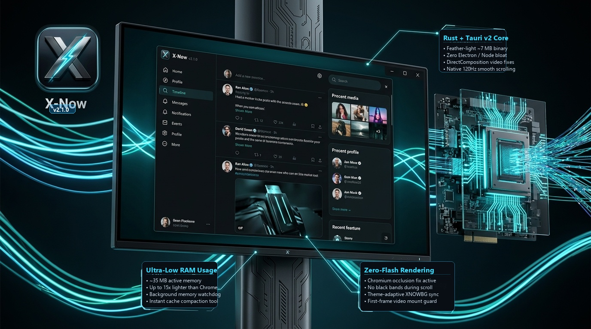
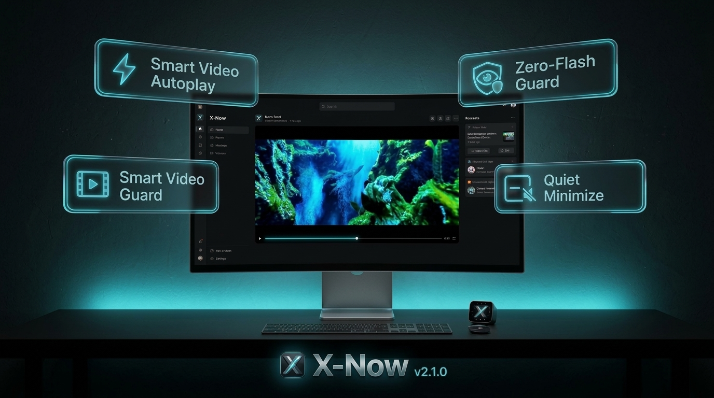
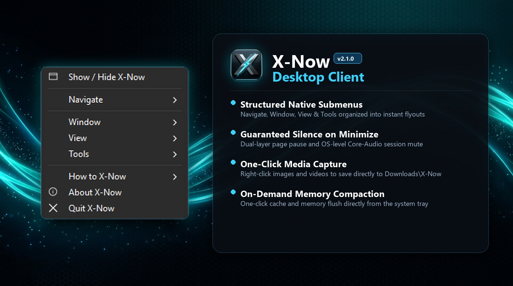

<p align="center">
  
</p>

<h1 align="center">X-Now</h1>

<p align="center">
  <strong>A high-performance, cross-platform desktop client for <a href="https://x.com">X (Twitter)</a></strong><br/>
  Built with <a href="https://tauri.app">Tauri v2</a> + Rust · WebView2 · WebKit
</p>

<p align="center">
  <strong>🚀 X-NOW v2.1.0</strong><br/>
  <em>Readable typography, a structured native tray, and consistent new branding.</em>
</p>

<p align="center">
  <strong>v2.1.0 highlights</strong><br/>
  <em>15px composer text · 17px sidebar text · grouped native tray actions · branded icons · redesigned About card</em>
</p>

<p align="center">
  
  
  
  
  
  
  <a href="https://github.com/benedictusrey"></a>
</p>

---

## 🚀 Welcome to the Future of X on Desktop

**X-Now** isn't just a wrapper — it's a meticulously engineered native desktop client that supercharges your X experience. Designed for speed, aesthetics, and power users, X-Now seamlessly bridges the gap between the X web and your operating system.

> X-Now is not affiliated with, sponsored by, or maintained by X Corp. or Twitter, Inc. Use X and any downloader service according to their terms, local law, and the rights attached to the media.

### ✨ At a glance

| | |
|---|---|
| 🪟 **Close-to-tray** | The ✕ button hides the app to the tray — media pauses instantly, one click brings it back |
| 🔇 **Guaranteed pause on minimize** | Page pause + OS-level audio-session mute + a Rust watchdog: no background audio, ever |
| 🖱️ **Tray command center** | Feed shortcuts, zoom, always-on-top, memory compaction, launch-on-startup |
| 💾 **One-click media saving** | Right-click images (full resolution) and videos — straight to `Downloads\X-Now` |
| 🔗 **Links go where they belong** | One click on any outside link → your default browser opens it |
| 🔐 **Seamless in-app login** | Google & Apple sign-in popups handled inside the app, auto-closed after login |
| 🎨 **Consistent X-Now identity** | The refreshed icon set appears in the window, tray, About card, launcher, and Windows installers |
| ⚡ **Feather-light** | A single ≈7 MB binary — no Electron, no Node, no bloat |

### 🌟 Why Choose X-Now?

#### 1. Unrivaled Performance & Efficiency
Say goodbye to the heavy memory usage of standard web browsers. Built entirely on Rust and Tauri v2, X-Now is designed to be incredibly lightweight. It actively manages background resources, meaning your computer stays blazing fast and responsive — even during endless scrolling sessions. Your X feed, delivered at native speed.

<p align="center">
  
</p>

#### 2. Immersive & Distraction-Free Aesthetics
X-Now strips away the browser clutter to give you a pure, edge-to-edge experience with native styling. Videos are optimized to play smoothly as you scroll — pausing instantly when out of view to protect your RAM. The result: a cinematic, browser-free timeline session.

<p align="center">
  
</p>

#### 3. Deep Operating System Integration
Why open a browser tab when you can command everything from your taskbar? X-Now lives in your OS like a true native application. Close it and it keeps living in your system tray; minimize it and the audio stops — guaranteed. Right-click images and videos to save them natively to `Downloads\X-Now`, or pin the window above everything with one tray toggle.

<p align="center">
  
</p>

---

## v2.1.0 Highlights

X-Now v2.1.0 brings a major leap forward in rendering stability, compositor smoothness, typography, tray architecture, and visual identity while maintaining full feature parity with v2.0.0.

### 🛡️ Rock-solid rendering stability
- **Video Mount Guard**: Solves the jarring black flash gap when scrolling through video-heavy feeds. X's player chrome mounts black for ~3 frames before media paints; the mount guard hides unpainted players until the first video frame decodes (`data-xnow-mount-wait`).
- **Theme-Adaptive Native Background (`XNOWBG`)**: Synchronizes the WebView2 window background color with X's computed theme at runtime. Completely eliminates dark flash bands on light theme and white flashes on dark theme during scrolling and window restores.
- **Decoupled DirectComposition Overlays**: Prevents video overlay planes from lagging the window compositor and producing detached black bands during fast scrolling (`--disable-direct-composition-video-overlays`).
- **Occlusion Tracker Disabled**: Suppresses Chromium's `CalculateNativeWinOcclusion`, preventing the window surface from bleaching white during intense video churn.
- **Event-Driven Watchdog & Idle Efficiency**: Replaced fixed 800ms polling with event-driven condvar wakeups and adaptive idle route polling (1s → 5s → 15s → 30s), cutting OS wakeups by ~6× and saving battery while hidden in the tray.

### ✍️ Curated desktop typography
- The post composer and reply boxes type at **15px** (down from X's ~19px default).
- The primary sidebar, the **More** button, its flyout, and X dropdown menus read at **17px**.
- Applied cleanly via in-page styling without altering your remote X account settings.

### 🖱️ Structured native tray controls
- Native context submenus for **Navigate ▸**, **Window ▸**, **View ▸**, **Tools ▸**, and **How to ▸**, alongside **Show / Hide**, **About**, and **Quit**.
- Every clickable action carries a crisp **16×16 white icon glyph**.
- **Native engine zoom** (`set_zoom`, 100%–300% tracked in Rust) replaces the old CSS zoom hack, preventing misplaced overlays and detached video layers.
- Checkmarks dynamically mirror live state for **Always on top** and **Launch on Startup**.

### 🎨 Refreshed branding & modern About card
- Purpose-made icon renders for every surface: **32px tray icon**, **48px window icon**, application launcher, and Windows installer packages.
- Redesigned **About X-Now** overlay featuring the HD brand icon (embedded base64 data URI), live version tag, author credit, and two-column feature chips.

---

## 📊 Comprehensive Comparison: v2.1.0 vs v2.0.0

| Subsystem / Capability | X-Now v2.0.0 | X-Now v2.1.0 (Latest) | Real-World Impact |
|---|---|---|---|
| **Video Mount Transition** | Black player gap (~3 frames) flashed on every video post while scrolling | **Video Mount Guard** hides unpainted player chrome until first frame renders | Eliminates the jarring black flash during timeline scrolling |
| **Compositor Background** | Hardcoded dark background (`#0f1419`) | **Theme-Adaptive Background (`XNOWBG`)** syncs native background to X theme dynamically | No dark flash bands on light theme; seamless match in all modes |
| **GPU Video Overlays** | DirectComposition overlay planes enabled (detached on geometry changes) | **DirectComposition Video Overlays Disabled** (`--disable-direct-composition-video-overlays`) | Eliminates detached black bands and compositor stutter during fast scroll |
| **Window Occlusion** | Native-window occlusion tracker active (could bleach window on video churn) | **Occlusion Tracking Disabled** (`CalculateNativeWinOcclusion`) | Prevents bleached/white window surface after heavy media sessions |
| **Watchdog & Resource Polling** | Continuous 800ms fast polling loop on watchdog thread | **Event-Driven Condvar Wakeups** + adaptive idle route poll (1s → 5s → 15s → 30s) | Up to 6× fewer wakeups; saves CPU & battery while minimized in tray |
| **Typography & Readability** | Stock X sizes (19px composer, varying sidebar item sizes) | **Curated Desktop Typography** (15px composer, 17px sidebar, flyout, and menu labels) | Balanced, desktop-proportioned readability without altering account settings |
| **Tray Menu Architecture** | Flat menu list with Unicode emojis | **Structured Native Submenus** (`Navigate ▸`, `Window ▸`, `View ▸`, `Tools ▸`, `How to ▸`) | Cleaner desktop workflow with native hover flyouts on Win/Mac/Linux |
| **Tray Icons & Indicators** | Text-only with emojis; manual checkmarks | **16×16 White Icon Glyphs** on all actions; native live-state checkmarks | Clean, elegant desktop aesthetic with synchronized toggle state |
| **Page & Window Zoom** | `document.body.style.zoom` CSS hack (broke fixed overlays & video layers) | **Native Engine Zoom** (`set_zoom`, 100%–300% tracked in Rust) | True engine-level scaling without layout desynchronization |
| **Branding & Visual Assets** | Legacy bird logo; single low-res icon downscaled by OS (blurry) | **Unified Multi-Scale HD Branding** (32px tray, 48px window, NSIS, multi-res ICNS) | Pixel-perfect clarity across all DPI scales and OS taskbars |
| **About Card Experience** | Basic in-page overlay with legacy logo | **Redesigned Modern Card** with brand icon data URI and 2-column feature chips | Informative, polished presentation without leaving the signed-in page |
| **Runtime Diagnostics & Bisect** | Fixed configuration, no runtime toggles | **5 CLI Flags & Env Overrides** (`--no-occlusion-fix`, `--no-gpu-video-overlays-fix`, etc.) | Instant troubleshooting and bisecting without rebuilding |
| **CI / CD Pipeline** | Platform-specific manual builds | **Unified GitHub Actions Pipeline** with universal macOS DMG & SHA-256 verification | Fast, automated, cross-platform builds without wasting runner minutes |

---

## ⚔️ X-Now vs X Native Web

Same X, same account, same feed — but the *wrapper around it* is where the desktop magic lives. X-Now keeps the official X experience and adds the OS integration a browser tab can't offer:

| Capability | ✕ X-Now v2.1.0 | 🌐 X Web (browser tab) |
|---|---|---|
| **Window & tray presence** | Dedicated native window + system-tray icon with feed shortcuts | One tab among dozens, no app identity |
| **Close button** | Closes to the tray — app keeps running, media pauses instantly | Closes the tab and the whole browser stays heavy |
| **Minimize** | Video audio stops the moment the window hides (page + OS audio-session mute, double-guaranteed) | Tab keeps playing audio in the background |
| **Launch on startup** | Optional — starts hidden to the tray, ready when you are | Must re-open the browser and the tab |
| **Saving images** | Right-click image → saved at **full resolution** to `Downloads\X-Now` in one action, with a bottom-right "Saved ✓" toast | Browser right-click menu — often blocked by the site |
| **Saving videos** | Right-click video → **the clicked post's video** downloads directly as MP4 when X exposes it; otherwise the post link is copied and [Cobalt](https://cobalt.tools/) opens with `Downloads\X-Now` pre-created — never a wrong video | Manual copy/paste between tabs |
| **External links** | One click on any outside link — your default browser opens it as the system handler | New tabs pile up |
| **Login** | Google & Apple sign-in popups open inside the app — the OAuth token relay stays intact, and the popup closes itself after login | Popup-blockers and tab juggling |
| **Titlebar** | Shows `X-Now (@yourhandle)` once signed in | Browser tab title only |
| **About & identity** | In-app About card with the X-Now icon and the author's credit — no window hop | No equivalent |
| **Always on top** | One tray toggle pins the window above everything | Not possible |
| **Memory footprint** | One lean WebView2 process (≈7 MB binary, no Electron) | A full browser engine + every extension |

> **Bottom line:** X-Now is not a different X — it is the *desktop experience* X should have had. Same content, same login, zero learning curve; every superpower lives outside the page, where the browser can't reach.

---

## Quick Start

### Use the Release Builds

Release assets are published on the [GitHub Releases](https://github.com/benedictusrey/X-Now/releases) page with verified SHA-256 manifests:

| Platform | Installer Packages | Notes |
|---|---|---|
| **Windows 10/11** | NSIS `.exe` setup, WiX `.msi`, and portable `.exe` | Requires Edge WebView2 Runtime |
| **macOS** | Universal `.dmg` (Apple Silicon `arm64` + Intel `x86_64`) | macOS 11 or newer, native on all Macs |
| **Linux** | Standalone `.AppImage`, Debian `.deb`, Fedora/RHEL `.rpm` | Requires WebKitGTK 4.1 runtime |

### Windows

1. Install the [Microsoft Edge WebView2 Runtime](https://developer.microsoft.com/en-us/microsoft-edge/webview2/) if not already present.
2. Run the downloaded `.exe` NSIS installer or the `.msi` package.
3. Sign in through the official X page shown inside the app.
4. Reopen **X-Now** later to resume your existing session automatically.
5. Use the system-tray icon for navigation, media saving, and app controls.

The login session is stored by the WebView2 application data folder on the local machine. X-Now does not implement a secondary profile manager — X's own account-switching UI handles multiple signed-in accounts.

### macOS

1. Open the downloaded universal `.dmg` and drag **X-Now** to your Applications folder.
2. On first launch, right-click and choose **Open** to approve the unsigned build in Gatekeeper.
3. Sign in through the X page that appears inside the app.

### Linux

1. Make the AppImage executable: `chmod +x *.AppImage`
2. Run it: `./*.AppImage`
3. Sign in through the X page inside the app.

> **Tip:** On some Linux distributions you may need `libwebkit2gtk-4.1` installed: `sudo apt install libwebkit2gtk-4.1-dev`

---

## Media & Audio Behaviour

| Context | Default audio | Behaviour |
|---|---:|---|
| Feed videos (timeline, autoplaying) | Muted, following X's own rule | Autoplay when 50% visible; pause instantly when scrolled out of view — one video at a time |
| Lightbox / standalone video page | 50% after your first interaction | Unmuted once you click into the media; X's own mute and fullscreen controls stay the authority |
| Minimize / close-to-tray | — | Every video and audio element pauses instantly; Windows also mutes the app's OS audio sessions as a hard guarantee |
| Restore | — | Playback resumes only for media that is still on screen — exactly what X's engine would autoplay anyway |

X-Now never adds duplicate player chrome: play, mute, fullscreen, captions and quality stay X's own controls.

---

## Saving & Opening Media

Right-click any image or video and choose the save action. A notification card slides in at the **bottom-right corner**: a spinner while the download runs, then **"Saved ✓"** with the folder — or a red card with the reason if it fails. Downloads are completely silent (no console window, ever).

### Images

Right-click any image in your feed and choose **Save image**. X-Now resolves the best direct URL and saves the **full-resolution original** (the `name=orig` variant) to the folder below, creating it when needed:

```text
%USERPROFILE%\Downloads\X-Now
```

*(On macOS and Linux, the equivalent user Downloads folder is used.)*

Source resolution order: full-resolution variants → the element's own URL → the post page's `og:image` → loaded CDN resources — with both a native (curl) downloader and a CORS-safe in-page fetch as delivery paths.

### Videos

Right-click any video and choose **Save video**. X-Now always targets the **clicked post's video**:

1. **Direct MP4 save** — the video's own URL, or the post page's video URLs (`og:video` / `twitter:player:stream` / embedded JSON), or resources pinned to the video via its poster's media ID. Saved straight to `Downloads\X-Now`, no Cobalt round-trip.
2. **Cobalt hand-off** (only when X hides the direct URL behind a streamed `blob:`) — the post link is copied, `Downloads\X-Now` is pre-created, and [Cobalt](https://cobalt.tools/?u=<post-link>) opens in your default browser with the link pre-filled; choose the format there and save into the prepared folder.

The same hand-off is one tray click away: **Open Cobalt video downloader**.

> X-Now downloads X's own CDN URLs exactly as the page exposes them — it does not bypass X access controls, and media rights belong to the post's author.

### Default Browser

- **Click any external link** (a link pointing outside x.com, including `t.co` redirects) — X-Now hands it to your default browser, which opens it automatically as the system handler. X's own links (posts, profiles, notifications) stay in-app.
- Right-click a link and choose **Open link in default browser** for the same hand-off on demand.
- The native Tauri shell validates every destination as an HTTP(S) URL before opening.

---

## Requirements

- **Windows** 10/11 (64-bit) with [Edge WebView2 Runtime](https://developer.microsoft.com/en-us/microsoft-edge/webview2/), **macOS** 11+ for the universal build, or **Linux** x64 for the published installers.
- Internet access to load X and any external link.
- A signed-in X session for account-specific content.

---

## Build from Source

Install [Node.js](https://nodejs.org/), [Rust](https://rustup.rs/), and the [Tauri 2 CLI](https://tauri.app/start/), then run the checks from the repository root:

```sh
node --check frontend/x-tools.js

cd src-tauri
cargo fmt --all -- --check
cargo check
npx --yes @tauri-apps/cli@2 build --ci
```

To keep build products outside the source tree on Windows:

```powershell
$env:CARGO_TARGET_DIR = 'C:\path\to\x-now-build-target'
npx --yes @tauri-apps/cli@2 build --ci --no-sign
```

---

## Privacy & Security Notes

X-Now does not add analytics or a remote account database. X page traffic is handled by X's service natively inside WebView2/WebKit. The local session data stays on the local computer. The native bridge exposes only the narrow actions required for: opening safe external URLs, saving media bytes, preparing the download folder, and downloading a media URL that X has already exposed.

Treat the following as private:

- WebView session data and your signed-in account state.
- Downloaded media in `Downloads\X-Now`.
- Any copied X post URL.

The README showcase images are synthetic mockups and contain no actual user account data.

---

## Verification Checklist (Release Review)

The repository checks validate JavaScript syntax, Rust formatting, Rust dependency compilation, and package generation. They do not replace a manual signed-in WebView check because X can update its DOM and media delivery at any time. For a release review, verify in this order:

1. Open Home, Explore, and a post's lightbox — confirm no blank or frozen views.
2. Play a video in the timeline, then scroll it out of view — it must pause.
3. Minimize the window with a video playing — audio must stop; restore — it must resume on screen.
4. Close (✕) — the app must stay in the tray; tray click must restore it.
5. Test right-click saving for an image and a video; confirm output in `Downloads\X-Now` (video may hand off to Cobalt when X exposes only a streamed URL).
6. Test external-link routing: click a `t.co` link in a post — it must open in the default browser; X's own links must stay in-app.

---

## 📚 Documentation

| Document | What you'll find |
|---|---|
| [RELEASE_NOTES.md](RELEASE_NOTES.md) | What's new in v2.1.0 — everything changed since v2.0.0, platform by platform |
| [CHANGELOG.md](CHANGELOG.md) | Full version history, one entry per release |
| [SECURITY.md](SECURITY.md) | Supported versions, security & privacy guarantees |
| [CONTRIBUTING.md](CONTRIBUTING.md) | Welcoming contribution guide, architectural invariants, and Pull Request steps |
| [AUTHORS.md](AUTHORS.md) | Authorship declaration, intellectual integrity, and anti-rebranding policy |
| [AGENTS.md](AGENTS.md) | Provenance, anti-rebranding directives, and locked architectural pillars for AI agents |
| [docs/RELEASE_PIPELINE.md](docs/RELEASE_PIPELINE.md) | GitHub Actions workflow guide, cross-platform build matrix, and release steps |
| [docs/GITHUB_DESKTOP_PUBLISHING.md](docs/GITHUB_DESKTOP_PUBLISHING.md) | Step-by-step walkthrough for publishing to GitHub using GitHub Desktop |
| [docs/BUILD_AND_FIXES.md](docs/BUILD_AND_FIXES.md) | **Mandatory reading before touching `lib.rs`, `tray.rs`, or `frontend/x-tools.js`** — every rendering fix (root cause → mechanism → bisect flag), exact build sequence, verification chain, and known gotchas |
| [backup/README.md](backup/README.md) | 🔒 The protected known-good snapshot of this exact verified release — restore point for anti-regression; read its rules before editing anything it covers |

---

## Rendering Workarounds & Diagnostics (per launch)

> Deep dive: **`docs/BUILD_AND_FIXES.md`** documents every rendering fix (root cause → mechanism → bisect flag), the full build sequence, verification chain, and known gotchas. Read it before changing `lib.rs`, `tray.rs`, or `frontend/x-tools.js`.

X-Now ships with three rendering safeguards for WebView2 on Windows:

1. **Theme-adaptive background** — the page reports its real theme color (`XNOWBG:r,g,b`) and the app re-syncs the native WebView2 background at runtime, so unpainted scroll/restore frames never contrast with the content (no dark-flash-on-light while scrolling, no white flash in dark mode).
2. **Occlusion tracker disabled** (`CalculateNativeWinOcclusion`) — the tracker can misclassify the window during heavy video churn and leave the restored window bleached.
3. **DirectComposition video overlays disabled** — the overlay planes detach/re-attach on every geometry change and can leave one-frame black bands while scrolling or at restore/resize.
4. **Video mount guard** (page-level, `frontend/x-tools.js`) — X's own player chrome mounts **black** for the first ~3 compositor frames before any poster/video content paints, so every static↔video post transition produces a jaggy black pop that none of the GPU/occlusion fixes can reach (the gap is *inside* the media rect). The guard hides a freshly mounted or src-swapped `<video>` (plus its dark wrapper) behind `visibility:hidden` until its first frame actually decodes (`loadeddata`/`canplay`/`playing`, 1.5 s failsafe), letting the white card show through instead. It re-arms on `loadstart`/`emptied` because X's virtualized feed recycles the same `<video>` node across posts.

Every launch prints the effective configuration to the log:

```text
[X-Now] Launch config: webview_args="--disable-features=msWebOOUI,msPdfOOUI,msSmartScreenProtection,CalculateNativeWinOcclusion --disable-direct-composition-video-overlays" dark_background=true diagnostics=false
[X-Now] Native background synced to page theme: #ffffff
```

| Flag | Effect |
|---|---|
| *(none)* | Stock behavior — theme-adaptive background + occlusion fix + video-overlay fix (recommended) |
| `--no-occlusion-fix` | Drops only the occlusion-tracker fix |
| `--no-gpu-video-overlays-fix` | Drops only the DirectComposition video-overlay fix (use if a black band ever reproduces) |
| `--webview-default` | Full stock WebView2 behavior (white background, no workarounds) |
| `--webview-args "..."` | Full custom WebView2 argument list (the wry UI defaults are always kept) |
| `--webview-diagnostics` | Logs webview runtime state (visibility, video count, decode health) at startup and on every hide/show transition |

For installed copies where the shortcut cannot be edited, the environment variable `XNOW_WEBVIEW_ARGS` applies the same override as `--webview-args` (the CLI flag wins when both are present). The `[X-Now]` log lines are written to stderr, so run X-Now from a terminal when capturing diagnostics — appending `2> xnow.log` saves them to a file. When reporting a rendering issue, attach a `--webview-diagnostics` launch log. Two verification tools back the fixes: the per-frame **screencast harness** (`scripts/xnow-screencast-flash-test.js`, requires `npm i playwright-core`) captures *every compositor frame* via CDP while scrolling the live app and correlates flashes with video lifecycle events (screenshots cannot catch 1-frame transients), and the **JS contract harness** (`npm run test:js` → `scripts/verify-xnow-helpers.js`, 88 assertions over jsdom) guards every `x-tools.js` behavior contract — run both after any change to `x-tools.js`.

---

## Author

X-Now is conceived, engineered, and maintained solely by  
**Benedictus Reynaldo Hartanto** ([@benedictusrey](https://github.com/benedictusrey))  
Repository: [https://github.com/benedictusrey/X-Now](https://github.com/benedictusrey/X-Now)

The project is intentionally independent from X Corp. and Twitter, Inc. Contributions and reproducible bug reports are welcome — provided they do not include credentials, private session data, or private downloaded media.
