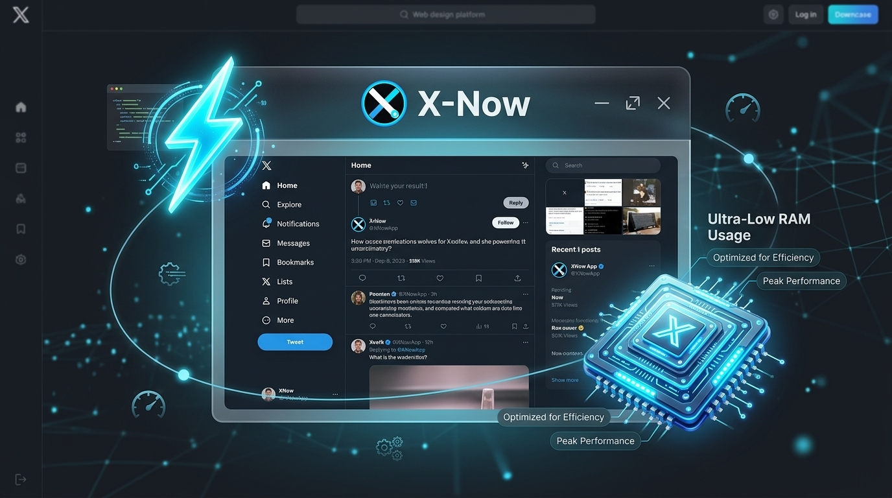
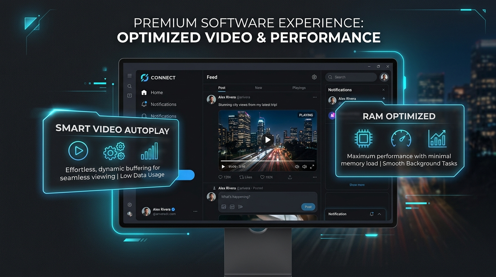
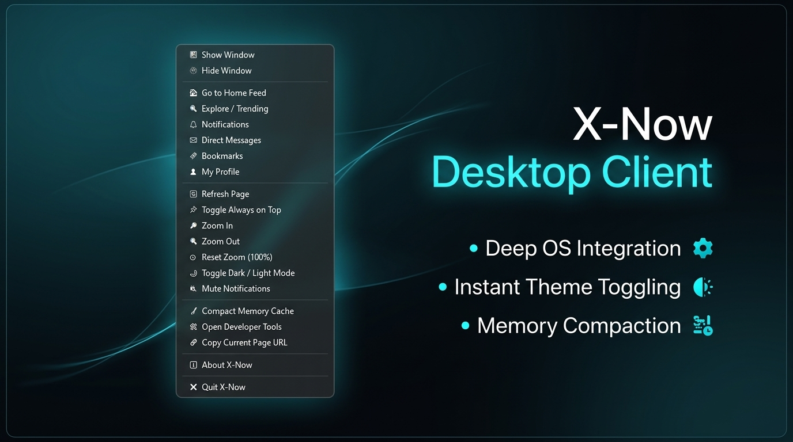

<p align="center">
  
</p>

<h1 align="center">X-Now</h1>

<p align="center">
  <strong>A high-performance, cross-platform desktop client for <a href="https://x.com">X (Twitter)</a></strong><br/>
  Built with <a href="https://tauri.app">Tauri v2</a> + Rust · WebView2
</p>

<p align="center">
  <strong>🎉 X-NOW RELEASE: v1.1.0 IS NOW LIVE! 🎉</strong><br/>
  <em>After meticulous development, the latest official build of X-Now is ready for deployment.</em>
</p>

<p align="center">
  
  
  
  
  
  <a href="https://github.com/benedictusrey"></a>
</p>

---

## 🚀 Welcome to the Future of X on Desktop

**X-Now** isn't just a wrapper—it's a meticulously engineered native desktop client that supercharges your X experience. Designed for speed, aesthetics, and power users, X-Now seamlessly bridges the gap between the web and your OS. 

### 🌟 Why Choose X-Now?

#### 1. Unrivaled Performance & Efficiency
Say goodbye to the heavy memory usage of standard web browsers. Built entirely on Rust and Tauri v2, X-Now is designed to be incredibly lightweight. It actively manages background resources, meaning your computer stays blazing fast and responsive—even during infinite scrolling sessions.
<p align="center">
  
</p>

#### 2. Immersive & Distraction-Free Aesthetics
X-Now strips away the browser clutter to give you a pure, edge-to-edge experience. We've removed native window borders and drop shadows to achieve a sleek, glassmorphic UI. Plus, videos are optimized to play smoothly as you scroll and pause instantly when out of view, ensuring a beautiful but RAM-friendly feed.
<p align="center">
  
</p>

#### 3. Deep Operating System Integration
Why open a browser tab when you can control everything from your taskbar? X-Now lives in your Windows system tray, offering a powerful command center. With a simple right-click, you can instantly toggle dark mode, natively mute all audio, jump straight to your bookmarks, or even flush your memory cache. 
<p align="center">
  
</p>

---

## ✨ Key Features in Detail

| Feature | How It Works |
|---|---|
| 🌐 **Authentic X Experience** | Renders the real `https://x.com` directly through Microsoft's ultra-fast WebView2 engine, giving you the authentic feed in a native app format. |
| 🔐 **Seamless Native Login** | Forget getting kicked out to external browsers. X-Now securely handles Google and Apple sign-ins directly within the app using native OAuth relays. |
| 🎬 **Smart Video Autoplay** | Intelligently plays videos only when they are 50% visible on your screen, and pauses them instantly when you scroll past. It caps playback to one video at a time to aggressively save memory. |
| 🔇 **True JS Muting** | Instantly silence your timeline. Muting injects custom scripts directly into the WebView to explicitly block all HTML5 `<audio>` and `<video>` playback without touching your X account settings! |
| 🖥️ **Command Center Tray** | A robust system tray menu offering everything from zoom controls and auto-start logic to instant memory compaction tools—all perfectly integrated with native OS checkmarks. |
| 🚀 **Feather-Light Binary** | A pure compiled executable that completely avoids the heavy bloat associated with traditional Electron or Node.js desktop apps. |
| 🖼️ **Perfect Default Layout** | Launches flawlessly at a custom 1300x850 (1.53:1) resolution that dynamically scales on 4K and 2K monitors without layout shifting. |

---

## 📦 Installation 

### Windows (`.exe` / `.msi`)
1. Download `X-Now_v1.1.0.exe` or the `X-Now_1.1.0_x64-setup.exe` installer from [Releases](../../releases).
2. Double-click to run. (The installer will add desktop shortcuts).
3. **Verify Integrity**: Compare the file hash against `checksums.txt` in the release assets.

### macOS & Linux
See the [Releases](../../releases) page for `.dmg`, `.app`, `.deb`, and `AppImage` files automatically built by our GitHub Actions pipeline.

---

## 🛠 Building from Source

### Prerequisites

| Tool | Version | Install |
|---|---|---|
| Rust | ≥ 1.75 | [rustup.rs](https://rustup.rs) |
| Node.js | ≥ 18 (optional) | [nodejs.org](https://nodejs.org) |
| WebView2 Runtime | Latest | Pre-installed on Windows 11 |

### Quick Build

```bash
# Clone the repository
git clone https://github.com/benedictusrey/x-now.git
cd x-now

# Development run (hot-reload)
cd src-tauri && cargo tauri dev

# Production build
cd src-tauri && cargo tauri build
```

---

## 🔒 Security

- All navigation is handled securely within the WebView2 sandbox.
- No custom backend servers, telemetry, or data collection.
- OAuth flows use x.com's official implementation.
- See [SECURITY.md](SECURITY.md) for vulnerability reporting.

---

## 📄 License

MIT © 2026 [@benedictusrey](https://github.com/benedictusrey)

See [LICENSE](LICENSE) for details.

---

## 👤 Author

**[@benedictusrey](https://github.com/benedictusrey)** — Author & Sole Creator of X-Now

> X-Now is an independent project and is not affiliated with, endorsed by, or connected to X Corp. or Twitter, Inc.
